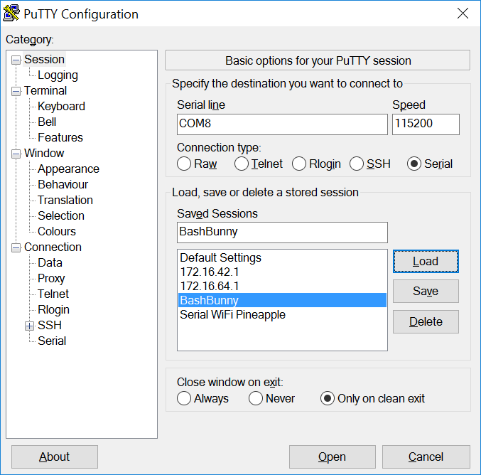

# Bash Bunny Basics

The Bash Bunny by Hak5 is the world’s most advanced USB attack platform. It delivers penetration testing attacks and IT automation tasks in seconds by emulating combinations of trusted USB devices – like gigabit Ethernet, serial, flash storage and keyboards. With it, computers are tricked into divulging data, exfiltrating documents, installing backdoors and many more exploits.

## Contributing to the Wiki

### Thank You
The Bash Bunny Wiki is brought to you by Hak5 and many other community members. As a community driven resource, the people who use and edit the wiki would be very grateful if you followed the guidelines below. 

All changes to the wiki can be contributed on [GitHub](https://github.com/hak5/bashbunny-wiki)

### Markdown
- Markdown Basics: https://help.github.com/articles/markdown-basics/
- Markdown Syntax: http://daringfireball.net/projects/markdown/syntax
- Table Generator: http://www.tablesgenerator.com/markdown_tables

## Where to get payloads

Many payloads are hosted from the centralized library on the Hak5 git repository at [github.com/hak5/bashbunny-payloads](https://github.com/hak5/bashbunny-payloads). Payloads from this repository are contributed from the Bash Bunny community. As with any script downloaded from the Internet, you are advised to proceed with caution. Similarly, many community developed tools exist for working with the Bash Bunny, such as [BunnyToolkit.com](https://bunnytoolkit.com/).

**WARNING:** Community payloads come with absolutely no warranty. You are solely responsible for the outcome of their execution.

## Switch Positions

In Switch Position 3 (closest to the USB plug) the Bash Bunny will boot into _arming mode_, enabling both Serial and Mass Stoage. From this dedicated mode, Bash Bunny payloads may be managed via Mass Storage and the Linux shell can be accessed by the Serial console.


## Mass Storage Directory Structure


* /_docs_ - home to documentation.
* /_languages_ - install additional HID Keyboard layouts/languages.
* /_loot_ - used by payloads to store logs and other data
* /_tools_ - used to install additional deb packages and other tools.
* /_payloads_ - home to active payloads, library and extensions 
* /_payloads_/_switch1_ and _/payloads_/_switch2_ - home to payload.txt and accompanying files which will be executed on boot when the bash bunny switch is in the corresponding position.
* /_payloads_/_library_ - home to the payloads library which can be downloaded from the [Bash Bunny Payload git repository](https://github.com/hak5/bashbunny-payloads "Bash Bunny Payload git repository")
* /_payloads_/_library_/_extensions_ - home to Bunny Script extensions 


## Default Settings

* Username: root
* Password: hak5bunny
* IP Address: 172.16.64.1
* DHCP Range: 172.16.64.10-12

## LED Status

| LED                  | Status                                                            |
| -------------------- | ----------------------------------------------------------------- |
| Green (blinking)     | Booting up                                                        |
| Blue (blinking)      | Arming Mode                                                       |
| Red (blinking)       | Recovery Mode or Firmware Flashing *from v1.0* **DO NOT UNPLUG**  |
| Red/Blue Alternating | Recovery Mode or Firmware Flashing *from v1.1+* **DO NOT UNPLUG** |

## Tools

While many tools can be installed to the Bash Bunny as you would any typical Debian based Linux computer, such as *apt-get*, *git clone*, a dedicated tools folder from the mass storage partition simplifies the process. Accessible from arming mode, tools in either .deb format or entire directories can be easily copied to /tools on the root of the mass storage partition. Then on the next boot of the Bash Bunny in Arming mode, these tools will be installed - indicated by LED SETUP (Solid Magenta light). 

On boot into arming mode, any .deb file placed in the tools folder will be installed with dpkg. Then any remaining file or directory will be moved to /tools on the root file system.

Some payloads may require additional third party tools. For example, the rdp_checker payload requires impacket to be located in /tools/impacket. This can be installed by copying either the impacket directory or an impacket.deb file to the /tools directory and booting into arming mode. The rdp_checker payload also makes use of the **REQUIRETOOL** Bunny Script extension, which checks for the existence of this tool and exits with a red blinking FAIL LED state if the tool is not found.


## Languages

Bash Bunny payloads can execute keystroke injection attacks similar to the USB Rubber Ducky by using the HID ATTACKMODE. By default this mode uses a US keyboard layout. Additional keyboard layouts may be developed by the community. Installing additional keyboard layouts is similar to use of the tools folder on the root of the USB mass storage partition. On bootup into arming mode, any two-letter-country-code.json file located in the /languages folder on the root of the USB mass storage partition will be installed. The file will remain in /languages after installation.

With a new language file installed, one may specify the keyboard layout from a payload by using the **DUCKY_LANG** extension. This extension accepts a two letter country code. 

**Example:**
```
DUCKY_LANG us
```


---


# Bash Bunny Serial Console

The Bash Bunny features a dedicated serial console from its _arming mode_. From serial, its Linux shell may be accessed. 

## Serial Settings

* 115200/8N1
* Baud: 115200
* Data Bits: 8
* Parity Bit: No
* Stop Bit: 1

## Connecting to to the Bash Bunny Serial Console from Windows
Find the COM# from Device Manager > Ports (COM & LPT) and look for USB Serial Device (COM#). Example: COM3
Alternatively, run the following powershell command to list ports:
```
[System.IO.Ports.SerialPort]::getportnames()
```



Open PuTTY and select Serial. Enter COM# for serial line and 115200 for Speed. Click Open.

[Download PuTTY](http://www.chiark.greenend.org.uk/~sgtatham/putty/latest.html "Download PuTTY")


## Connecting to the Linux Bash Bunny Console from Linux/Mac
1. Find the Bash Bunny device from the terminal
```
ls /dev/tty*" or "dmesg | grep tty
```
> Usually on a Linux host, the Bash Bunny will register as either /dev/ttyUSB0 or /dev/ttyACM0.  On an OSX/macOS host, the Bash Bunny will register as /dev/tty.usbmodemch000001.

2. Next, connect to the serial device using screen, minicom or your terminal emulator of choice. 
> If screen is not installed it can usually be found from your distributions package manager.
```
sudo apt-get install screen
```
**Connecting with screen**
```
sudo screen /dev/ttyACM0 115200
```
> Disconnect with keyboard combo: CTRL+a followed by CTRL+\


---

# Getting the Bash Bunny Online

Getting the Bash Bunny online can be convenient for a number of reasons, such as installing software with apt or git. Similar to the WiFi Pineapple, the host computers Internet connection can be shared with the Bash Bunny. Begin by setting the Bash Bunny to Ethernet mode. For Windows hosts, you'll want to boot the bash bunny with a payload.txt containing ATTACKMODE RNDIS_ETHERNET On a Linux host you'll most likely want ATTACKMODE ECM_ETHERNET. With the Bash Bunny booted and registering on your host computer as an Ethernet device, you can now share its Internet connection.

## Sharing an Internet Connection with the Bash Bunny from Windows
1. Configure a payload.txt for ATTACKMODE RNDIS_ETHERNET
2. Boot Bash Bunny from RNDIS_ETHERNET configured payload on the host Windows PC
3. Open Control Panel > Network Connections (Start > Run > "ncpa.cpl" > Enter)
4. Identify Bash Bunny interface. Device name: "USB Ethernet/RNDIS Gadget"
5. Right-click Internet interface (e.g. Wi-Fi) and click Properties.
6. From the Sharing tab, check "Allow other network users to connect through this computer's Internet connection",  select the Bash Bunny from the Home networking connection list (e.g. Ethernet 2) and click OK.
7. Right-click Bash Bunny interface (e.g. Ethenet 2) and click Properties.
8. Select TCP/IPv4 and click Properties.
9. Set the IP address to 172.16.64.64. Leave Subnet mask as 255.255.255.0 and click OK on both properties windows. Internet Connection Sharing is complete

## Sharing an Internet Connection with the Bash Bunny from Linux

1. From your Linux computer download the Internet Connection Sharing script from bashbunny.com/bb.sh
2. Run the bb.sh connection script with bash as root
3. Follow the [M]anual or [G]uided setup to configure iptables and routing
4. Save settings for future sessions and [C]onnect

~~~~
wget bashbunny.com/bb.sh
sudo bash ./bb.sh
~~~~

## Sharing an Internet Connection with the Bash Bunny from OSX
1. Configure a payload.txt for ATTACKMODE ECM_ETHERNET STORAGE
2. Boot Bash Bunny from ECM_ETHERNET configured payload
3. Open a terminal on the OSX host. Install Macports if you don't have it installed already. http://macports.org
4. Install and set up Squid on the OSX host:
  ~~~
  sudo port install squid
  sudo squid -Z
  sudo squid
  ~~~
5. You will now have an open (!!) proxy running on all interfaces of your host. If you are not in a trusted environment, limit the interface in the squid.conf file. 
6. SSH to the bash bunny
~~~
ssh root@172.16.64.1
~~~
7. Set up the proxy server using environment variables.
~~~
export http_proxy=http://172.16.64.10:3128   <-- change the IP address to match the host IP if needed
~~~
8. Your bash bunny should now be on-line. 
~~~
apt-get update; apt-get upgrade 
~~~
---

# Technical Details

## Disk Partitions

| PARTITION  | Description                                     |
| ---------- | ----------------------------------------------- |
| /dev/root  | Main Linux file system                          |
| /dev/nandg | Recovery file system (**do not modify**)        |
| /dev/nandf | Mass storage partition (mounted at /root/udisk) |

## Firmware Recovery
1. Set the Bash Bunny switch to position 3 (arming mode)
2. Plug the Bash Bunny into a USB power source. The LED will momentarily light green. As soon as the LED goes off, unplug the Bash Bunny.
3. Repeat the previous step twice more (for a total of 3 times)
4. Plug the Bash Bunny into a USB power source and leave for 4 minutes. The LED will light RED to indicate recovery. When the light returns to BLUE blinking, the Bash Bunny has recovered.

**DO NOT UNPLUG THE BASH BUNNY DURING RECOVERY**


## Specifications
* Quad-core ARM Cortex A7
* 32 K L1/512 K L2 Cache
* 512 MB DDR3 Memory
* 8 GB SLC NAND Disk

### Power Requirements
* USB 5V ~1.5A
